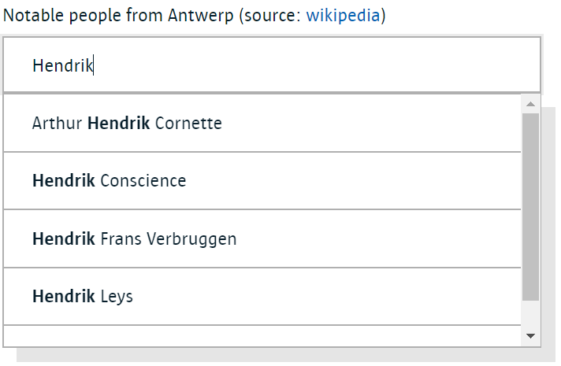
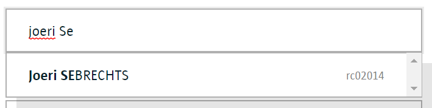

# Contact Picker Smart Widget UI (Angular)

This is the Angular 5+ UI for a Smart Widget implementing a picker field to choose a person from a list of contacts. It is matched by a [corresponding back-end service](https://github.com/digipolisantwerp/contact-picker_service_nodejs) which is needed when running it in remote mode. A default implementation for selecting people from [CRS Medewerker](https://acpaas.digipolis.be/nl/product/crs-medewerker) is provided.



There is a demo app, see below for instructions on running it.

## How to use

### Installing

Copy the .npmrc file from this repo to your local repo to set up the link to nexusrepo.antwerpen.be npm repository.

Then install (you will need to be connected to the Digipolis network):

```sh
> npm install @acpaas-ui-widgets/ngx-contact-picker
```

### Local mode

In this mode, the data backing the picker is passed from the surrounding application code instead of fetched from a remote back-end.

Import the component in your module:

```ts
@NgModule({
  imports: [
    ...,
    ContactPickerModule
  ],
  ...
})
```

In the index.html, include the core branding stylesheet:

```html
<link rel="stylesheet" href="https://cdn.antwerpen.be/core_branding_scss/2.0.1/main.min.css">
```

In your template:

```html
<aui-contact-picker
    [data]="listOfPeople"
    [(value)]="person">
</aui-contact-picker>
```

In the component code:

```ts
class YourComponent {

    // you can assign an initial value here
    person: ContactPickerValue;

    listOfPeople: ContactPickerValue[] = [
        { id: '0', name: 'Abraham Ortelius', ... },
        ...
    ];

    ...
}
```

Every value in the backing list must have a unique id. If names can be the same it is recommended to use a differentiator as described below.

Supported attributes:

- **data**: An array of value objects to use as the backing store
- **value**: The current value of the picker, represented as a value object
- **placeholder**: specify the text to show in an empty field
- **noDataMessage**: the text shown in the list when there are no matching results
- **differentiator**: a field from the backing value object to be displayed as a *tag* on the right side of the list items, to help the user discern the difference between multiple matches with the same name.

    `<aui-contact-picker differentiator="userName" ...`
    

Events:

- **valueChange**: triggers when the current value is changed (or cleared)

### Remote mode

In this mode, the picker is backed by a remote service queried for results matching what the user types.

```html
<aui-contact-picker
    [(value)]="person"
    url="/api/people">
</aui-contact-picker>
```

Additional attributes:

- **url**: the URL of the back-end service feeding this widget
- **bufferInputMs**: how long to buffer keystrokes before fetching remote results

The backing service implements the following protocol:

- GET /path/to/endpoint?search=...
- search = the text that the user typed on which to match
- result = JSON-encoded array of [ContactPickerValue](src/contact-picker/contact-picker.types.ts) objects

## Run the demo app

Set up the .npmrc (see above), then run:

```sh
> npm install
> npm start
```

Browse to [localhost:4200](http://localhost:4200)

To use the remote page, you will need to have also started [the backing service](https://github.com/digipolisantwerp/contact-picker_service_nodejs).

## Contributing

We welcome your bug reports and pull requests.

Please see our [contribution guide](CONTRIBUTING.md).

## License

This project is published under the [MIT license](LICENSE.md).
